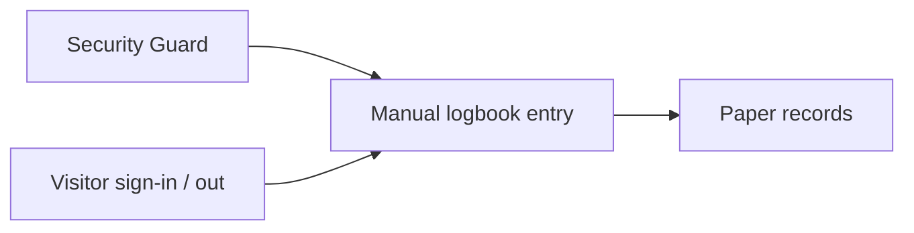
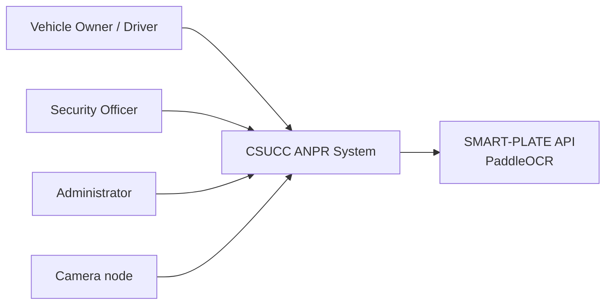
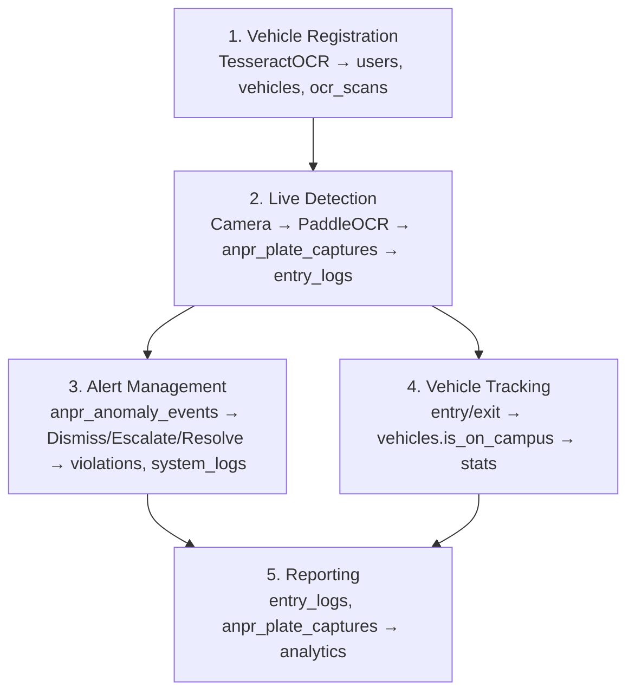
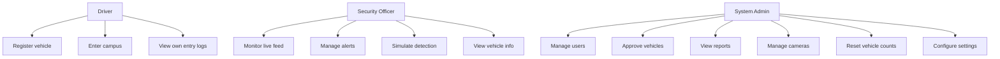
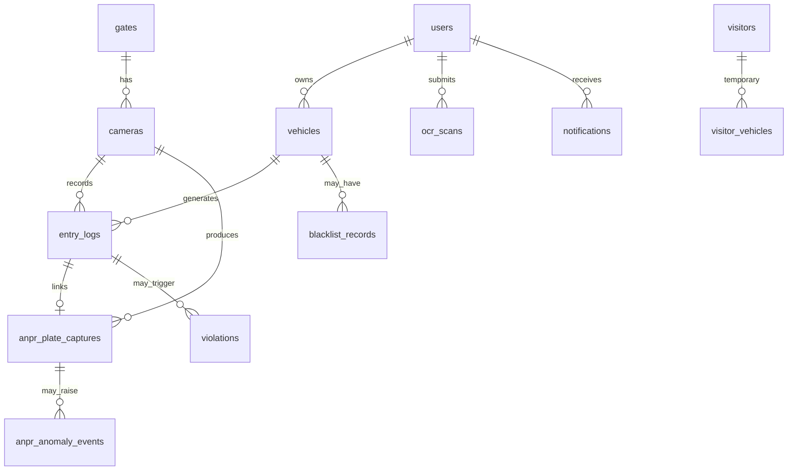
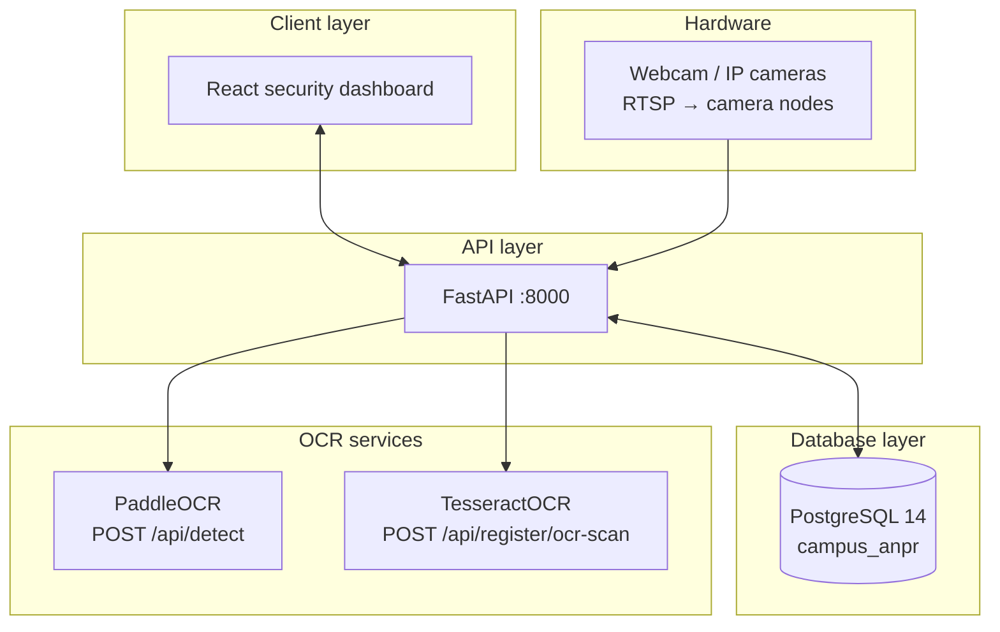

# CSUCC ANPR — System diagrams (Figures 3–8)

Documentation for the architecture and analysis views referenced in `CSUCC_ANPR_Dashboard_Prompt.md`. Diagrams use [Mermaid](https://mermaid.js.org/) (render in GitHub, VS Code, or export to PNG/SVG).

---

## Figure 3 — Current DFD (Diagram 0)

Manual gate process before ANPR automation.

---

## Figure 4 — Proposed context DFD

External entities and the CSUCC ANPR system boundary.

---

## Figure 5 — Proposed Diagram 0 DFD (main processes)

---

## Figure 6 — Use case diagram

---

## Figure 7 — ERD (primary relationships)

Aligned with `schema_all.sql` v2.0.

---

## Figure 8 — System architecture (layers)

---

*These diagrams match the entity relationships described in `backend/schema_all.sql` and the API surface under `backend/app/api/`.*
