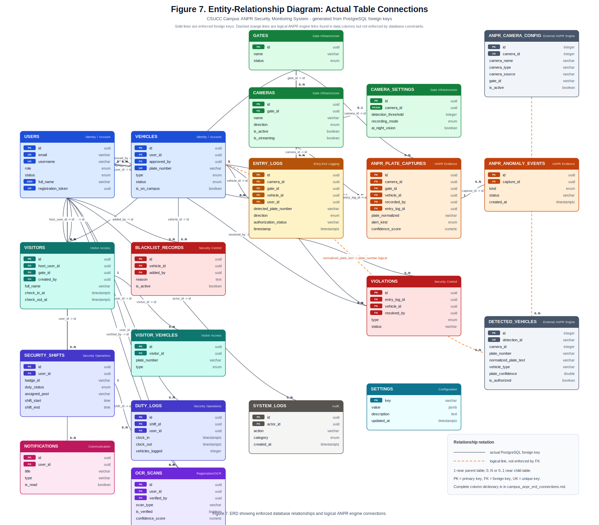

# Campus ANPR ERD - Accurate Relationship Connections

Source SQL dump: `C:\Users\User\Documents\campus_anpr.sql`
Generated: 2026-05-16 20:26:42

This version focuses on the actual connections between entities. Solid relationships come directly from PostgreSQL foreign-key constraints in the SQL dump. Dashed logical relationships are included only where the schema stores matching values but does not enforce a foreign key.

## Main Flow

`users -> vehicles -> entry_logs -> anpr_plate_captures -> anpr_anomaly_events`

`entry_logs -> violations`, `vehicles -> blacklist_records`, and `users -> notifications/ocr_scans/security_shifts/system_logs` support oversight, compliance, registration, and audit functions.

## ERD Figure



## Actual Foreign-Key Connections

| Parent table | Parent key | Child table | Child FK | Parent -> child | Child parent requirement | On delete | Meaning |
| --- | --- | --- | --- | --- | --- | --- | --- |
| anpr_plate_captures | id | anpr_anomaly_events | capture_id | 1 to 0..N | required | CASCADE | anomaly from capture |
| cameras | id | anpr_plate_captures | camera_id | 1 to 0..N | optional | SET NULL | capture source camera |
| cameras | id | camera_settings | camera_id | 1 to 0..1 | optional | CASCADE | 1 camera has 0/1 settings |
| cameras | id | entry_logs | camera_id | 1 to 0..N | optional | NO ACTION | captured by camera |
| entry_logs | id | anpr_plate_captures | entry_log_id | 1 to 0..N | optional | SET NULL | evidence for log |
| entry_logs | id | violations | entry_log_id | 1 to 0..N | optional | CASCADE | violation source log |
| gates | id | anpr_plate_captures | gate_id | 1 to 0..N | optional | SET NULL | capture source gate |
| gates | id | cameras | gate_id | 1 to 0..N | optional | SET NULL | camera installed at gate |
| gates | id | entry_logs | gate_id | 1 to 0..N | optional | NO ACTION | recorded at gate |
| gates | id | visitors | gate_id | 1 to 0..N | optional | NO ACTION | checked in at gate |
| security_shifts | id | duty_logs | shift_id | 1 to 0..N | optional | CASCADE | belongs to shift |
| users | id | anpr_plate_captures | recorded_by | 1 to 0..N | optional | SET NULL | recorded by operator |
| users | id | blacklist_records | added_by | 1 to 0..N | optional | NO ACTION | added by admin |
| users | id | duty_logs | user_id | 1 to 0..N | optional | CASCADE | clocked by officer |
| users | id | entry_logs | user_id | 1 to 0..N | optional | SET NULL | vehicle owner |
| users | id | notifications | user_id | 1 to 0..N | optional | CASCADE | recipient |
| users | id | ocr_scans | user_id | 1 to 0..N | optional | CASCADE | submitted by user |
| users | id | ocr_scans | verified_by | 1 to 0..N | optional | NO ACTION | verified by admin |
| users | id | security_shifts | user_id | 1 to 0..N | optional | CASCADE | assigned officer |
| users | id | system_logs | actor_id | 1 to 0..N | optional | SET NULL | actor |
| users | id | vehicles | approved_by | 1 to 0..N | optional | NO ACTION | approved by admin |
| users | id | vehicles | user_id | 1 to 0..N | optional | CASCADE | owner account |
| users | id | violations | resolved_by | 1 to 0..N | optional | NO ACTION | resolved by user |
| users | id | visitors | created_by | 1 to 0..N | optional | NO ACTION | registered by officer |
| users | id | visitors | host_user_id | 1 to 0..N | optional | NO ACTION | campus host |
| vehicles | id | anpr_plate_captures | vehicle_id | 1 to 0..N | optional | SET NULL | matched registered vehicle |
| vehicles | id | blacklist_records | vehicle_id | 1 to 0..N | optional | CASCADE | blacklisted vehicle |
| vehicles | id | entry_logs | vehicle_id | 1 to 0..N | optional | SET NULL | detected vehicle |
| vehicles | id | violations | vehicle_id | 1 to 0..N | optional | SET NULL | violating vehicle |
| visitors | id | visitor_vehicles | visitor_id | 1 to 0..N | optional | CASCADE | visitor vehicle |

## Logical Connections Not Enforced by FK

| Source | Target | Connection | Reason |
| --- | --- | --- | --- |
| anpr_camera_config | detected_vehicles | detected_vehicles.camera_id -> anpr_camera_config.camera_id | ANPR engine detection uses configured camera_id |
| vehicles | detected_vehicles | detected_vehicles.normalized_plate_text -> vehicles.plate_number | plate text can be matched to registered vehicle plate |

Important note: `anpr_camera_config.gate_id` is a `varchar`, while `gates.id` is a `uuid`; the SQL dump does not define a safe FK between those tables. I left that out as an enforced relationship so the thesis ERD stays accurate.

## Entity Connection Summary

| Entity | Connected to | Role in system |
| --- | --- | --- |
| users | anpr_plate_captures, blacklist_records, duty_logs, entry_logs, notifications, ocr_scans, security_shifts, system_logs, vehicles, violations, visitors | Account holder, administrator, security officer, visitor host, and audit actor. |
| vehicles | anpr_plate_captures, blacklist_records, detected_vehicles, entry_logs, users, violations | Registered vehicle owned by a user and referenced by logs, captures, violations, and blacklist records. |
| gates | anpr_plate_captures, cameras, entry_logs, visitors | Physical access point connected to cameras, logs, visitors, and captures. |
| cameras | anpr_plate_captures, camera_settings, entry_logs, gates | Device installed at a gate and linked to logs, captures, and camera settings. |
| camera_settings | cameras | Gate Infrastructure |
| entry_logs | anpr_plate_captures, cameras, gates, users, vehicles, violations | Central entry/exit transaction that connects vehicles, users, cameras, gates, captures, and violations. |
| anpr_plate_captures | anpr_anomaly_events, cameras, entry_logs, gates, users, vehicles | ANPR evidence record connected to camera, gate, vehicle, user recorder, and entry log. |
| anpr_anomaly_events | anpr_plate_captures | ANPR Evidence |
| violations | entry_logs, users, vehicles | Security Control |
| blacklist_records | users, vehicles | Security Control |
| visitors | gates, users, visitor_vehicles | Temporary campus visitor connected to host user, creator user, gate, and visitor vehicle. |
| visitor_vehicles | visitors | Visitor Access |
| security_shifts | duty_logs, users | Security Operations |
| duty_logs | security_shifts, users | Security Operations |
| notifications | users | Communication |
| ocr_scans | users | Registration/OCR |
| system_logs | users | Audit |
| settings | standalone | Configuration |
| anpr_camera_config | detected_vehicles | External ANPR Engine |
| detected_vehicles | anpr_camera_config, vehicles | External ANPR Engine |

## Mermaid Source

```mermaid
erDiagram
    ANPR_PLATE_CAPTURES ||--o{ ANPR_ANOMALY_EVENTS : "anpr_anomaly_events.capture_id -> anpr_plate_captures.id"
    CAMERAS ||--o{ ANPR_PLATE_CAPTURES : "anpr_plate_captures.camera_id -> cameras.id"
    ENTRY_LOGS ||--o{ ANPR_PLATE_CAPTURES : "anpr_plate_captures.entry_log_id -> entry_logs.id"
    GATES ||--o{ ANPR_PLATE_CAPTURES : "anpr_plate_captures.gate_id -> gates.id"
    USERS ||--o{ ANPR_PLATE_CAPTURES : "anpr_plate_captures.recorded_by -> users.id"
    VEHICLES ||--o{ ANPR_PLATE_CAPTURES : "anpr_plate_captures.vehicle_id -> vehicles.id"
    USERS ||--o{ BLACKLIST_RECORDS : "blacklist_records.added_by -> users.id"
    VEHICLES ||--o{ BLACKLIST_RECORDS : "blacklist_records.vehicle_id -> vehicles.id"
    CAMERAS ||--o| CAMERA_SETTINGS : "camera_settings.camera_id -> cameras.id"
    GATES ||--o{ CAMERAS : "cameras.gate_id -> gates.id"
    SECURITY_SHIFTS ||--o{ DUTY_LOGS : "duty_logs.shift_id -> security_shifts.id"
    USERS ||--o{ DUTY_LOGS : "duty_logs.user_id -> users.id"
    CAMERAS ||--o{ ENTRY_LOGS : "entry_logs.camera_id -> cameras.id"
    GATES ||--o{ ENTRY_LOGS : "entry_logs.gate_id -> gates.id"
    USERS ||--o{ ENTRY_LOGS : "entry_logs.user_id -> users.id"
    VEHICLES ||--o{ ENTRY_LOGS : "entry_logs.vehicle_id -> vehicles.id"
    GATES ||--o{ VISITORS : "visitors.gate_id -> gates.id"
    USERS ||--o{ NOTIFICATIONS : "notifications.user_id -> users.id"
    USERS ||--o{ OCR_SCANS : "ocr_scans.user_id -> users.id"
    USERS ||--o{ OCR_SCANS : "ocr_scans.verified_by -> users.id"
    USERS ||--o{ SECURITY_SHIFTS : "security_shifts.user_id -> users.id"
    USERS ||--o{ SYSTEM_LOGS : "system_logs.actor_id -> users.id"
    USERS ||--o{ VEHICLES : "vehicles.approved_by -> users.id"
    USERS ||--o{ VEHICLES : "vehicles.user_id -> users.id"
    ENTRY_LOGS ||--o{ VIOLATIONS : "violations.entry_log_id -> entry_logs.id"
    USERS ||--o{ VIOLATIONS : "violations.resolved_by -> users.id"
    VEHICLES ||--o{ VIOLATIONS : "violations.vehicle_id -> vehicles.id"
    VISITORS ||--o{ VISITOR_VEHICLES : "visitor_vehicles.visitor_id -> visitors.id"
    USERS ||--o{ VISITORS : "visitors.created_by -> users.id"
    USERS ||--o{ VISITORS : "visitors.host_user_id -> users.id"
    ANPR_CAMERA_CONFIG ||..o{ DETECTED_VEHICLES : "detected_vehicles.camera_id -> anpr_camera_config.camera_id (logical)"
    VEHICLES ||..o{ DETECTED_VEHICLES : "detected_vehicles.normalized_plate_text -> vehicles.plate_number (logical)"

    USERS {
        uuid id PK
        varchar email UK
        varchar username UK
        enum role
        enum status
        varchar full_name GEN
        uuid registration_token UK
    }

    VEHICLES {
        uuid id PK
        uuid user_id FK
        uuid approved_by FK
        varchar plate_number UK
        enum type
        enum status
        boolean is_on_campus
    }

    GATES {
        uuid id PK
        varchar name
        enum status
    }

    CAMERAS {
        uuid id PK
        uuid gate_id FK
        varchar name
        enum direction
        boolean is_active
        boolean is_streaming
    }

    CAMERA_SETTINGS {
        uuid id PK
        uuid camera_id FK/UK
        integer detection_threshold
        enum recording_mode
        boolean ai_night_vision
    }

    ENTRY_LOGS {
        uuid id PK
        uuid camera_id FK
        uuid gate_id FK
        uuid vehicle_id FK
        uuid user_id FK
        varchar detected_plate_number
        enum direction
        varchar authorization_status
        timestamptz timestamp
    }

    ANPR_PLATE_CAPTURES {
        uuid id PK
        uuid camera_id FK
        uuid gate_id FK
        uuid vehicle_id FK
        uuid recorded_by FK
        uuid entry_log_id FK
        varchar plate_normalized
        enum alert_kind
        numeric confidence_score
    }

    ANPR_ANOMALY_EVENTS {
        uuid id PK
        uuid capture_id FK
        enum kind
        varchar status
        timestamptz created_at
    }

    VIOLATIONS {
        uuid id PK
        uuid entry_log_id FK
        uuid vehicle_id FK
        uuid resolved_by FK
        enum type
        varchar status
    }

    BLACKLIST_RECORDS {
        uuid id PK
        uuid vehicle_id FK
        uuid added_by FK
        text reason
        boolean is_active
    }

    VISITORS {
        uuid id PK
        uuid host_user_id FK
        uuid gate_id FK
        uuid created_by FK
        varchar full_name
        timestamptz check_in_at
        timestamptz check_out_at
    }

    VISITOR_VEHICLES {
        uuid id PK
        uuid visitor_id FK
        varchar plate_number
        enum type
    }

    SECURITY_SHIFTS {
        uuid id PK
        uuid user_id FK
        varchar badge_id
        enum duty_status
        varchar assigned_post
        time shift_start
        time shift_end
    }

    DUTY_LOGS {
        uuid id PK
        uuid shift_id FK
        uuid user_id FK
        timestamptz clock_in
        timestamptz clock_out
        integer vehicles_logged
    }

    NOTIFICATIONS {
        uuid id PK
        uuid user_id FK
        varchar title
        varchar type
        boolean is_read
    }

    OCR_SCANS {
        uuid id PK
        uuid user_id FK
        uuid verified_by FK
        varchar scan_type
        boolean is_verified
        numeric confidence_score
    }

    SYSTEM_LOGS {
        uuid id PK
        uuid actor_id FK
        varchar action
        enum category
        timestamptz created_at
    }

    SETTINGS {
        varchar key PK
        jsonb value
        text description
        timestamptz updated_at
    }

    ANPR_CAMERA_CONFIG {
        integer id PK
        integer camera_id UK
        varchar camera_name
        varchar camera_type
        varchar camera_source
        varchar gate_id
        boolean is_active
    }

    DETECTED_VEHICLES {
        integer id PK
        varchar detection_id UK
        integer camera_id
        varchar plate_number
        varchar normalized_plate_text
        varchar vehicle_type
        double plate_confidence
        boolean is_authorized
    }
```

## Compact Data Dictionary

### `users`

| Column | Type | Key shown in ERD |
| --- | --- | --- |
| id | uuid | PK |
| email | varchar | UK |
| username | varchar | UK |
| role | enum |  |
| status | enum |  |
| full_name | varchar | GEN |
| registration_token | uuid | UK |

### `vehicles`

| Column | Type | Key shown in ERD |
| --- | --- | --- |
| id | uuid | PK |
| user_id | uuid | FK |
| approved_by | uuid | FK |
| plate_number | varchar | UK |
| type | enum |  |
| status | enum |  |
| is_on_campus | boolean |  |

### `gates`

| Column | Type | Key shown in ERD |
| --- | --- | --- |
| id | uuid | PK |
| name | varchar |  |
| status | enum |  |

### `cameras`

| Column | Type | Key shown in ERD |
| --- | --- | --- |
| id | uuid | PK |
| gate_id | uuid | FK |
| name | varchar |  |
| direction | enum |  |
| is_active | boolean |  |
| is_streaming | boolean |  |

### `camera_settings`

| Column | Type | Key shown in ERD |
| --- | --- | --- |
| id | uuid | PK |
| camera_id | uuid | FK/UK |
| detection_threshold | integer |  |
| recording_mode | enum |  |
| ai_night_vision | boolean |  |

### `entry_logs`

| Column | Type | Key shown in ERD |
| --- | --- | --- |
| id | uuid | PK |
| camera_id | uuid | FK |
| gate_id | uuid | FK |
| vehicle_id | uuid | FK |
| user_id | uuid | FK |
| detected_plate_number | varchar |  |
| direction | enum |  |
| authorization_status | varchar |  |
| timestamp | timestamptz |  |

### `anpr_plate_captures`

| Column | Type | Key shown in ERD |
| --- | --- | --- |
| id | uuid | PK |
| camera_id | uuid | FK |
| gate_id | uuid | FK |
| vehicle_id | uuid | FK |
| recorded_by | uuid | FK |
| entry_log_id | uuid | FK |
| plate_normalized | varchar |  |
| alert_kind | enum |  |
| confidence_score | numeric |  |

### `anpr_anomaly_events`

| Column | Type | Key shown in ERD |
| --- | --- | --- |
| id | uuid | PK |
| capture_id | uuid | FK |
| kind | enum |  |
| status | varchar |  |
| created_at | timestamptz |  |

### `violations`

| Column | Type | Key shown in ERD |
| --- | --- | --- |
| id | uuid | PK |
| entry_log_id | uuid | FK |
| vehicle_id | uuid | FK |
| resolved_by | uuid | FK |
| type | enum |  |
| status | varchar |  |

### `blacklist_records`

| Column | Type | Key shown in ERD |
| --- | --- | --- |
| id | uuid | PK |
| vehicle_id | uuid | FK |
| added_by | uuid | FK |
| reason | text |  |
| is_active | boolean |  |

### `visitors`

| Column | Type | Key shown in ERD |
| --- | --- | --- |
| id | uuid | PK |
| host_user_id | uuid | FK |
| gate_id | uuid | FK |
| created_by | uuid | FK |
| full_name | varchar |  |
| check_in_at | timestamptz |  |
| check_out_at | timestamptz |  |

### `visitor_vehicles`

| Column | Type | Key shown in ERD |
| --- | --- | --- |
| id | uuid | PK |
| visitor_id | uuid | FK |
| plate_number | varchar |  |
| type | enum |  |

### `security_shifts`

| Column | Type | Key shown in ERD |
| --- | --- | --- |
| id | uuid | PK |
| user_id | uuid | FK |
| badge_id | varchar |  |
| duty_status | enum |  |
| assigned_post | varchar |  |
| shift_start | time |  |
| shift_end | time |  |

### `duty_logs`

| Column | Type | Key shown in ERD |
| --- | --- | --- |
| id | uuid | PK |
| shift_id | uuid | FK |
| user_id | uuid | FK |
| clock_in | timestamptz |  |
| clock_out | timestamptz |  |
| vehicles_logged | integer |  |

### `notifications`

| Column | Type | Key shown in ERD |
| --- | --- | --- |
| id | uuid | PK |
| user_id | uuid | FK |
| title | varchar |  |
| type | varchar |  |
| is_read | boolean |  |

### `ocr_scans`

| Column | Type | Key shown in ERD |
| --- | --- | --- |
| id | uuid | PK |
| user_id | uuid | FK |
| verified_by | uuid | FK |
| scan_type | varchar |  |
| is_verified | boolean |  |
| confidence_score | numeric |  |

### `system_logs`

| Column | Type | Key shown in ERD |
| --- | --- | --- |
| id | uuid | PK |
| actor_id | uuid | FK |
| action | varchar |  |
| category | enum |  |
| created_at | timestamptz |  |

### `settings`

| Column | Type | Key shown in ERD |
| --- | --- | --- |
| key | varchar | PK |
| value | jsonb |  |
| description | text |  |
| updated_at | timestamptz |  |

### `anpr_camera_config`

| Column | Type | Key shown in ERD |
| --- | --- | --- |
| id | integer | PK |
| camera_id | integer | UK |
| camera_name | varchar |  |
| camera_type | varchar |  |
| camera_source | varchar |  |
| gate_id | varchar |  |
| is_active | boolean |  |

### `detected_vehicles`

| Column | Type | Key shown in ERD |
| --- | --- | --- |
| id | integer | PK |
| detection_id | varchar | UK |
| camera_id | integer |  |
| plate_number | varchar |  |
| normalized_plate_text | varchar |  |
| vehicle_type | varchar |  |
| plate_confidence | double |  |
| is_authorized | boolean |  |
